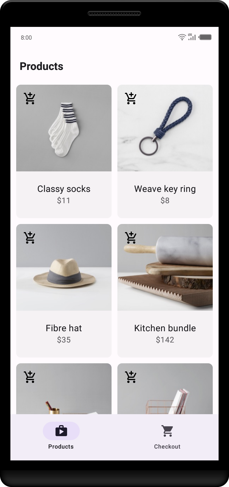
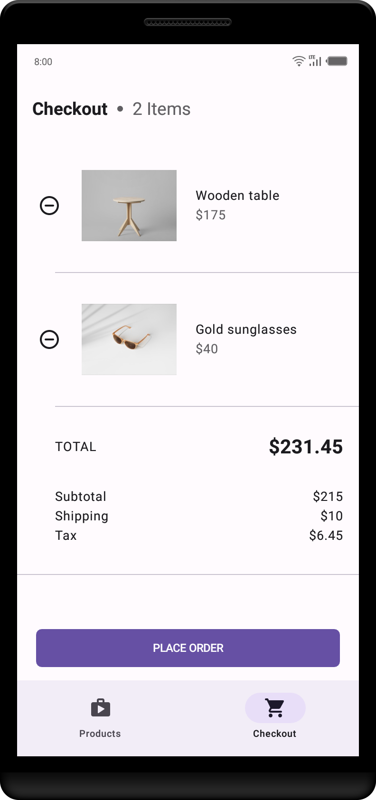
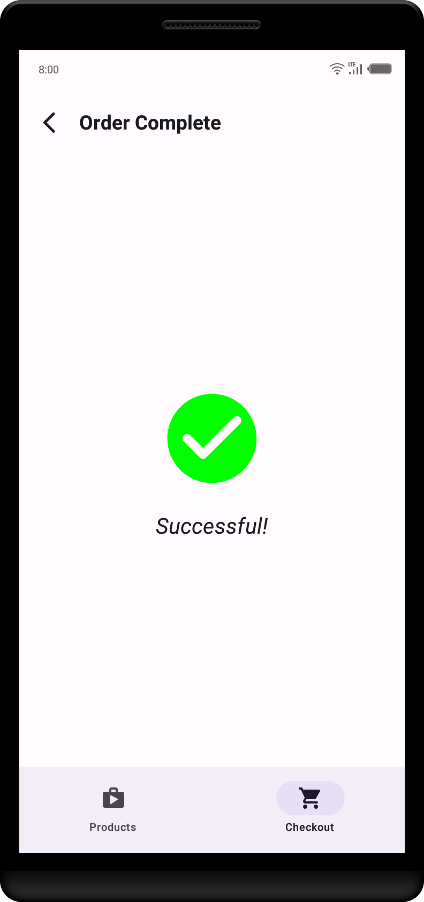

# Shopit
This shopping app is a task from HNG11 stage 1.

## Screenshots
|::::::::::::::::::::::::::::::::::::::::|::::::::::::::::::::::::::::::::::::::::|::::::::::::::::::::::::::::::::::::::::|
|:--:|:--:|:--:|
||||

## Features
* Shows list of products in a shop
* Add/remove products to/from cart
* Automatically sums up cart items and displays it in details
* Checkout cart items

## About

* This project was built with only native funtionalities and components and no third-party library or plugins.
* It has three screens:
    * `Projects screen` shows a list of products/items (statically) in a shop.
    * `Checkout screen` displays a checkout button and the products added to cart for checkout.
    * `Order Successful screen` is displayed after checking out cart items.

* Optimized apk to *1.8 MB*
* Clean and Simple Material UI
 

  ***Explore the virtualized demonstration of the release apk version [here](https://appetize.io/app/arrc6dg3fu5gxilmkmf2exgwui)***

  ***Or you can install the apk from below 👇🏽***

  

## Build Instructions
You can build the app via Android Studio, or by running the following command in your directory:

    ./gradle <assembleDebug | assembleRelease>

    You can then find the apk file in `shopit/app/build/outputs/apk`

## Developed with
* [Jetpack Compose](https://developer.android.com/jetpack/compose) - Jetpack Compose is Android’s recommended modern toolkit for building native UI.
* [Material3](https://m3.material.io) - Google's latest design system with adaptable components and tools that support the best practices of user interface design for building beautiful apps.
* [Kotlin Coroutine](https://kotlinlang.org/docs/coroutines-overview.html) - For executing tasks asynchronously.
* [ViewModel](https://developer.android.com/topic/libraries/architecture/viewmodel) - Stores UI-related data that isn't destroyed on UI changes.